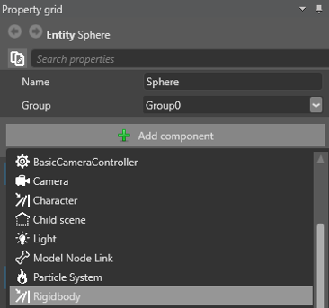
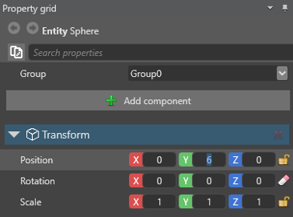
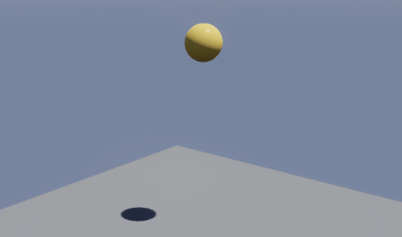
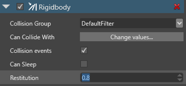
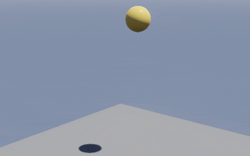
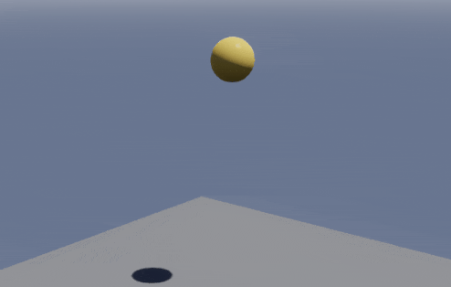
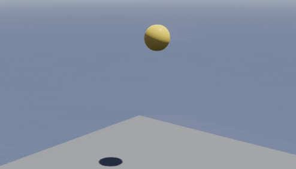

# Create a bouncing ball

In this tutorial, we'll use the [static collider](static-colliders.md) and [rigid body](rigid-bodies.md) components to create a ball bouncing on a floor.

## 1. Add the components

The default scene comes preloaded with five entities: Camera, Directional light, Skybox, Ground, and Sphere. We're going to add physics components to the **Ground** and **Sphere** entities.

Let's begin by adding a [static collider](static-colliders.md) component to the Ground entity.
   
1. Start a **New Game** project.

2. Select the **Ground** entity.

3. In the **Property grid**, click **Add component** and select **Static Collider**.

    

4. Now set the component shape to match the shape of the Ground entity.
In the **Property grid**, expand the **Static Collider component** to view its properties.

5. Next to **Collider Shapes**, click the **green + icon** and select **Infinite Plane**.

    

6. Add a rigid body component to the sphere. In the **Scene Editor**, select the **Sphere** entity.

7. In the **Property grid**, click **Add component** and select **Rigidbody**.

    

8. Just like you did for the Ground entity, set the rigid body component shape to match the shape of the Sphere.
In the **Property grid**, expand the **Rigidbody component** to view its properties.

9. Next to **Collider Shapes**, click the **green + icon** and select **Sphere**.

     

## 2. Set up the positions

Let's move the sphere so it begins in mid-air and falls to the ground.

1. Select the **Sphere** entity. 

2. In the **Property grid**, under **Transform**, set the **Position** to: _X: 0, Y: 6, Z: 0_

    

3. Now we'll move the camera to give us a good view of the scene. Select the **Camera** entity. 

4. In the **Property grid**, under **Transform**, set the **Position** to: _X: -12, Y: 7, Z: 9_

5. Set the **Rotation** to: _X: -20, Y: -50, Z: 0_

    

Let's see what the scene looks like so far: press **F5** to run the project.

The sphere (rigid body) responds to gravity and falls. The ground (static collider) breaks its fall. But there's no bounce effect yet.

## 3. Add bounce effect

To create a bounce effect, we need to change the **restitution** property of both physical objects.
This simulates the [coefficient of restitution (Wikipedia)](https://en.wikipedia.org/wiki/Coefficient_of_restitution) of the real-world collisions,
which measures the remaining kinetic energy after a collision.

If the restitution property of colliding entities is 0, the entities lose all energy and stop moving immediately on impact.
If the restitution is 1, they lose no energy and rebound with the same velocity at which they collided.

Let's set the restitution of your Sphere and Ground entities.

1. In the **Scene Editor**, select the **Sphere** entity.

2. In the **Property grid**, under **Rigidbody**, set the sphere's **Restitution** to 0.8.

    

3. In the **Scene Editor**, select the **Ground** entity.

4. In the **Property grid**, under **Static Collider**, set the **Restitution** to 0.5.

    

To see how this changes the physics, run the project again (**F5**). This time, the ball is bouncing on the ground:

Try changing the restitution of both entities to 1. This creates a ball that bounces forever, losing no energy:

Set the restitution to 1.1 and the ball bounces a little higher each time.

