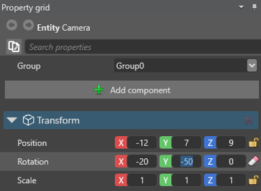
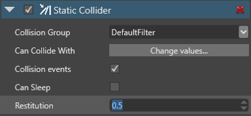

# Create a bouncing ball

Beginner
Designer

In this tutorial, we'll use the [static collider and rigid body components](../colliders.md) to create a ball bouncing on a floor.

## 1. Add the components
   
1. Start a **New Game** project.

    The default scene comes preloaded with five entities: Camera, Directional light, Skybox, Ground, and Sphere. We're going to add physics components to the **Ground** and **Sphere** entities.

    Let's begin by adding a static collider component to the Ground entity.

2. Select the **Ground** entity.

3. In the **Property grid**, click **Add component** and select **Static Collider**.

    

    A static collider is a physics object that doesn't move. Typical static colliders are walls, floors, large rocks, and so on.

4. Now set the [collider shape](../collider-shapes.md) to match the entity. In the **Property grid**, expand the **Static Collider component** to view its properties.

5. Next to **Collider Shapes**, click the **green + icon** and select **Infinite Plane**.

    

Next, we'll add a rigid body component to the sphere. 

6. In the **Scene Editor**, select the **Sphere** entity.

7. In the **Property grid**, click **Add component** and select **Rigidbody**.

    

    A rigid body is a physics object that moves — perfect for our bouncing ball.

Just like we did for the Ground entity, we're going to set the [collider shape](../collider-shapes.md) to match the entity.

8. In the **Property grid**, expand the **Rigidbody component** to view its properties.

9. Next to **Collider Shapes**, click the **green + icon** and select **Sphere**.

     

## 2. Set up the positions

Let's position the sphere so it starts in mid-air and falls to the ground.

1. Select the **Sphere** entity. 

2. In the **Property grid**, under **Transform**, set the **Position** to: _X: 0, Y: 6, Z: 0_

    

Now we'll move the camera to give us a good view of the scene. 

3. Select the **Camera** entity. 

4. In the **Property grid**, under **Transform**, set the **Position** to: _X: -12, Y: 7, Z: 9_

5. Set the **Rotation** to: _X: -20, Y: -50, Z: 0_

    

Let's see what the scene looks like so far. To run the project, press **F5**.

The sphere (rigid body) responds to gravity and falls. The ground (static collider) breaks its fall. But there's no bounce effect yet.

## 3. Add a bounce effect

To create a bounce effect, we need to change the **restitution** of both physical objects. This simulates the [coefficient of restitution (Wikipedia)](https://en.wikipedia.org/wiki/Coefficient_of_restitution) of real-world collisions. 

If the restitution property of colliding entities is 0, the entities lose all energy and stop moving immediately on impact. If the restitution is 1, they lose no energy and rebound with the same velocity at which they collided. If the restitution is higher than 1, they gain energy and rebound with _more_ velocity. As a rule, to create realistic collisions, set the restitution between 0 and 1.

Let's set the restitution of our Sphere and Ground entities.

1. In the **Scene Editor**, select the **Sphere** entity.

2. In the **Property grid**, under **Rigidbody**, set the **Restitution** to 0.8.

    

3. In the **Scene Editor**, select the **Ground** entity.

4. In the **Property grid**, under **Static Collider**, set the **Restitution** to 0.5.

    

To see how this changes the physics, run the project again (**F5**). This time, the ball bounces on the ground before coming to a stop:

Try changing the restitution of both entities to 1. This creates a ball that bounces indefinitely, losing no energy:

Set the restitution to 1.1 and the ball bounces a little higher each time:

Now we've created a bouncing ball, we can use it to learn about triggers. For more information, see the [Script a triggered event](script-a-triggered-event.md) tutorial.

## See also
* [Colliders](../colliders.md)
* [Collider shapes](../collider-shapes.md)
* [Tutorial: Script a triggered event](script-a-triggered-event.md)