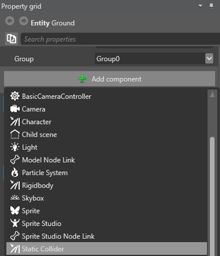
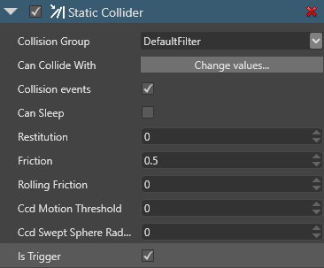
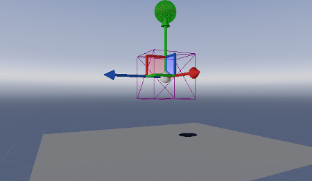

# Script a triggered event

<span class="label label-doc-level">Beginner</span>
<span class="label label-doc-audience">Designer</span>

In this tutorial, we'll create a **trigger** that doubles the size of a ball when the ball passes through it.

## 1. Add a trigger

1. Follow the instructions in the [Create a bouncing ball](create-a-bouncing-ball.md) tutorial.
This gives us a simple scene in which a ball falls from mid-air, hits the ground, and bounces.

2. For the purposes of this tutorial, set the restitution of both the sphere and the ground to 1, so the ball bounces indefinitely without losing energy:

    

    This isn't strictly necessary, but makes it easier to see the effect of the trigger later.

Now we'll add a trigger in the space between the ball and the ground, so the ball passes through it.

1. In the **Scene editor**, click the white plus sign (**Create new entity**) and select **Empty entity**.

    

Game Studio adds an entity to the scene with the default name **Entity**.

2. This entity will be our trigger, so rename it *Trigger*.

Since we don't need the trigger to move, we'll make it a static collider.

3. In the **Property grid**, click **Add component** and select **Static Collider**.

    

4. In the **Property grid**, expand the **Static Collider component** to view its properties.

5. Check the **Is Trigger** checkbox.

    

    This means objects can pass through the collider, but are still detected in the code.

6. We need to give the trigger a shape. Next to **Collider Shapes**, click the **green plus icon** and select **Box**.

    

7. Let's make the trigger a larger area. In the **Property grid**, under **Transform**, set the **scale** to: *X:2, Y:2, Z:2*

    

We need to position the trigger between the ground and the sphere, so the ball falls through it.
    
8. With the trigger entity selected, in the **Property grid**, under **Transform**, set the **Position** to: *X:0, Y:3, Z:0*

    Now the trigger entity is between the ground and the sphere:

    

## 2. Handle the trigger event with script

If we run the project now (**F5**), the ball falls through the trigger, but nothing happens. Note that the trigger is invisible, as we didn't give it a graphical component.


Let's write a script to change the size of the ball when it enters the trigger.

1. In the **Asset view**, click **Add asset** and select **Scripts** > **Async Script**.

    

2. In the **Script wizard** dialog, name your script *Trigger* and click **OK**.

    2a. If Game Studio asks if you want to save your script, click **Yes**.
    
    2b. If Game Studio asks if you want to reload the assemblies, click **Yes**.

3. Open the script, add the following code, and build your solution:

    ```
    using SiliconStudio.Xenko.Engine;
    using SiliconStudio.Xenko.Physics;
    using System.Threading.Tasks;
    using SiliconStudio.Core.Mathematics;

    namespace VolumeTrigger
    {
        public class Trigger : AsyncScript
        {
            public override async Task Execute()
            {
                var trigger = Entity.Get<PhysicsComponent>();
                trigger.ProcessCollisions = true;

                // Start state machine
                while (Game.IsRunning)
                {
                    // 1. Wait for an entity to collide with the trigger
                    var firstCollision = await trigger.NewCollision();

                    var otherCollider = trigger == firstCollision.ColliderA
                        ? firstCollision.ColliderB
                        : firstCollision.ColliderA;
                    otherCollider.Entity.Transform.Scale = new Vector3(2.0f, 2.0f, 2.0f);

                    // 2. Wait for the entity to exit the trigger
                    Collision collision;

                    do
                    {
                        collision = await trigger.CollisionEnded();
                    }
                    while (collision != firstCollision);

                    otherCollider.Entity.Transform.Scale= new Vector3(1.0f, 1.0f, 1.0f);
                }
            }
        }
    }
    ```

    This code doubles the size (scale) of any entity that enters the trigger. When the entity exits the trigger, it returns to its original size.

Finally, let's add this script to the trigger entity as a component.

4. Back in **Game Studio**, select the trigger entity.

5. In the **Property grid**, click **Add component** and select the **Trigger** script.

    

5. Run the project (**F5**) to see the trigger in action.
The ball falls through the trigger, doubles in size, exits the trigger, and returns to its normal size.

     

## See also
* [Colliders](../colliders.md)
* [Collider shapes](../collider-shapes.md)
* [Tutorial: Create a bouncing ball](create-a-bouncing-ball.md)