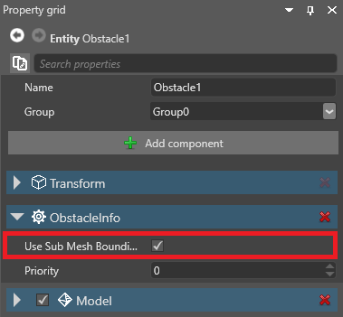

# Public properties and fields

When you declare a public property or field in a script, the property becomes accessible in Game Studio from the script component properties.



You can attach the same script to multiple entities and set different property values on each entity.

> [!Note] 
> Public properties or fields must be serializable to be used in Game Studio. 

## Add a public property or field

This script has a public property (`DelayTimeOut`):

```cs
public class SampleSyncScript : StartupScript
{
	// This public member will appear in Game Studio
	public float DelayTimeOut { get; set; }
}
```

Game Studio shows the `DelayTimeOut` property in the script component properties:


>[!Note]
>As a general rule, if you want to display the property or field in Game Studio, getters and setters should do as little as possible. For example, the getter or setter shouldn't try to call methods or access Xenko runtime API.

>The following code will create problems, as it tries to access `Entity.Components`, which is only available at runtime:

>```cs
>public class SampleSyncScript : StartupScript
>{
>	private float delayTimeOut;
>	// This public member will appear in Game Studio
>	public float DelayTimeOut
>	{
>		get { return delayTimeOut; }
>		set
>		{ 
>			delayTimeOut = value;
>			Entity.Components.Add(new SkyboxComponent());
>		}
>	}
>}
>```
>If you want to include code like this, hide it so it Game Studio doesn't display it (see below). 

## Hide properties or fields in the property grid

If you don't want Game Studio to show a property in the property grid, you can:

* declare your member internal or private, or
* use the [DataMemberIgnore](xref:SiliconStudio.Core.DataMemberIgnoreAttribute) attribute like this:

```cs

	// This public property isn't available in Game Studio
	[DataMemberIgnore]
	public float DelayTimeOut { get; set; }
	
```

Game Studio no longer shows the property:

![Public property been hidden with ```[DataMemberIgnore]```](media/scripts-in-xenko-public-property-with-datamemberignore.png)

## See also

* [Create a script](create-a-script.md)
* [Types of script](types-of-script.md)
* [Scheduling and priorities](scheduling-and-priorities.md)
* [Add a script](add-a-script.md)
* [Debugging](debugging.md)