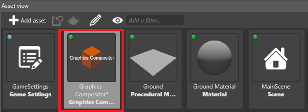
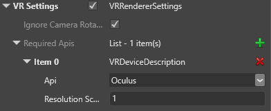
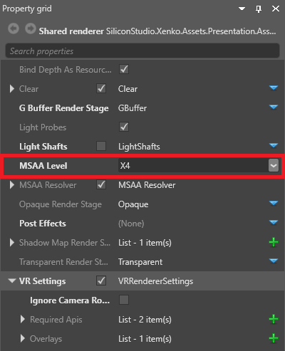

# Enable VR

Xenko supports virtual reality (VR) devices including Oculus Rift and Vive.

1. In the **asset view** (in the bottom pane by default), double-click the **Graphics Compositor**.

    

    The Graphics Compositor editor opens.

2. In the Graphics Compositor, select the **ForwardRenderer**.

    

3. In the **property grid** (on the right by default), expand **VR Settings**.

    

4. Next to **Required APIs**, click the green plus icon (**Add a new item to the list**).

    Game Studio adds a new API to the list.

    

5. From the **Item** drop-down menu, select a VR API you want your game to support. You can add as many as you need.

| API    | Description                                                                       |
|--------|-----------------------------------------------------------------------------------|
| Oculus | Supports Oculus Rift devices (best support for Oculus Rift)                                                      |
| OpenVR | Supports Vive and Oculus Rift devices (best support for Vive)                                             |
| Dummy  | Displays the game on the screen with two "eye cameras" instead of the VR device (mainly useful for development) |

6. Make sure the list order is correct.

    When your game runs, it attempts to use the devices in the list order. For example, if the first item is Dummy, the game uses no VR device. If the last item is Dummy, the game only uses it if there is no VR device available.

    >[!Tip]
    >Although the OpenVR API supports both Vive and Oculus Rift devices, the Oculus API provides better support for Oculus Rift. For this reason, we recommend the following list order:
    >
    >* Item 0: Oculus
    >
    >* Item 1: OpenVR
    >
    >This means your game will use the Oculus API if an Oculus Rift device is connected, and the OpenVR API if another device (such as a Vive) is connected.

7. Enable **VRRendererSettings**.

    

Your game is now ready to use VR.

>[!Note]
>After you change APIs, you need to reload the project (**File > Reload project**) for the change to take effect at runtime. This is a known issue and will be fixed in a future release.

## VR properties

| Property             | Description                                                                                                             |
|----------------------|-------------------------------------------------------------------------------------------------------------------------|
| Ignore camera rotation             | Disables camera movement from inputs other than VR devices, helping to reduce [VR sickness](vr-sickness.md)             |
| Resolution scale | The resolution of the image displayed in the VR device. Higher resolutions produce better images, but require more CPU. |

## Multisample anti-aliasing 

As aliasing artifacts are more obvious in VR, we recommend you enable **MSAA** (multisample anti-aliasing) in the ForwardRenderer properties (below the VR settings).

