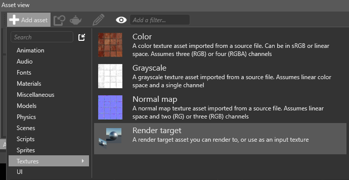
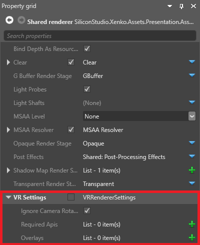

# Overlays

In VR games, it's often useful to display elements such as user interfaces as **overlays** that appear to float in the player view instead of a traditional UI. To do this, render the UI to a texture.

> ![Note]
> You can't see overlays when you don't run your game in your VR device. This is because the VR device itself creates the overlay, not other hardware. 

## 1. Create a render target texture

The render target texture will display the UI.

In the **asset view**, click **Add asset** and select **Texture** > **Render target**.

Game Studio adds a **render target** texture to your project assets.

 

## 2. Set up the VR overlay in the graphics compositor

For more information about the graphics compositor, see the [Graphics compositor](../graphics/graphics-compositor/index.md) page.

1. In the **asset view** (in the bottom pane by default), double-click the **Graphics Compositor**.

    

    The Graphics Compositor editor opens.

2. In the Graphics Compositor, select the **forward renderer** node.

    

3. In the **property grid** (on the right by default), expand **VR Settings**.

    

4. Next to **Overlays**, click  (**Add a new item to the list**).

    Game Studio adds a new overlay to the list.

    

5. Next to **Texture**, click  (**Pick an asset up**).

    The **asset picker** opens.

6. Select the **render texture** you created.

## 3. Set up the graphics compositor

To display an overlay, you need at least two renderers:

* one to render your main camera
* one to render the UI to the overlay

This page describes the simplest way to do this from scratch, using two cameras and two renderers. Depending on your pipeline, you might need to create a different setup.

> [!Warning]
> These instructions involve deleting your existing renderers for the game entry point. You might want to make a backup of your project in case you want to restore your pipeline afterwards.

1. In the graphics compositor, on the left, under **Render Features**, select the **UIRenderFeature**.

2. In the property grid, make sure **SimpleGroupToRenderStageSelector** is selected.

3. Under **Render Stage**, make sure **UIRenderStage** is selected.

    This means WHAT EXACTLY?

4. In the graphics compositor, select the **Entry points** node.

    

### 1. Render the texture

5. In the **property grid** on the right, next to **Game renderer**, click  (**Create a new instance with the selected type**) and select **None** to delete your existing renderers.

    

> [!Note]
> Currently, **all** renderers must have a camera, or be a child of a renderer that has a camera. This applies even to renderers that don't necessarily use cameras, such as the single stage renderer which we use to render the UI in these instructions. This will change in a future version.

1. Next to **Game rendererer**, click  (**Create a new instance with the selected type**) and select **Camera Renderer**.

> [!Note]
> Currently, **all** renderers must have a camera, or be a child of a renderer that has a camera. This applies even to renderers that don't necessarily use cameras, such as the single stage renderer, which renders the UI. This will change in a future version. In these instructions, we'll add a game renderer with a camera, then make the two renderers children of that renderer.

2. Next to **Camera**, click  (**Create a new instance with the selected type**) and select your main game camera.

3. Next to **Child**, click  (**Create a new instance with the selected type**) and select **SceneRendererCollection**.

4. Expand **Child**.

5. Click  (**Add a new item to the list**) and select **RenderTextureSceneRenderer**.

6. Next to **Child**, click  (**Create a new instance with the selected type**) and select **SingleStageRenderer**. 

7. Next to **Render Stage**, click  (**Create a new instance with the selected type**) and select **UIRenderStage**. This is the renderer that renders the UI.

7. Next to **Render Texture**, click  (**Pick an asset up**).

    The **asset picker** opens.

8. Select the **render texture** and click **OK**.

    

    Game Studio adds the render texture to the renderer.

10. Under **Game renderer**, next to **Children**, click  (**Add a new item to the list**) and select **Forward renderer**.

Your game is now ready to render the UI to an overlay in your VR device.

## Overlay properties

You can use the overlay properties to position the overlay in the VR device.

## Multiple overlays

## Sample

For an example of an overlay implemented in a VR game, see the VR sample included with Xenko.

## See also

* [Render to a texture](../graphics/graphics-compositor/render-to-a-texture.md)
* [Graphics compositor](../graphics/graphics-compositor/index.md)