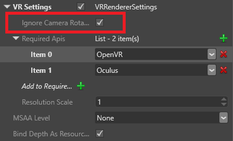

# Virtual reality sickness

Some players experience nausea and discomfort when playing VR games. Though the causes aren't completely understood, it seems to be mainly caused by the player moving around a virtual environment while their real-world body remains still.

There may be no way to completely prevent VR sickness in every player. However, there are a few things to keep in mind to minimize it in your game. We recommend you test your game with as wide a range of players as possible.

## Camera movement

In general, players should control the camera by moving their head. Moving the camera by other methods, such as gamepads or keyboards, seems to be the biggest cause of VR sickness, especially with horizontal (yaw) movement.

### Disable camera movement

To disable camera movement from inputs other than VR devices:

1. In the **asset view** (in the bottom pane by default), double-click the **Graphics Compositor**.

    

    The Graphics Compositor editor opens.

2. In the Graphics Compositor, select the **ForwardRenderer**.

    

3. In the **property grid** (on the right by default), expand **VR Settings**.

    

4. Select **Ignore camera rotation**. 

    

## Framerate

In general, the higher the framerate, the less likely players are to become sick. Framerates below 60fps seem especially likely to cause sickness.

## Vection

Vection is the sensation of movement caused by the environment changing. You might have experienced this in the real world, for example, if you've been on a stationary train and a nearby train moves, creating the sensation that your own train is moving in the opposite direction. This can cause sickness in VR.

To reduce vection in your game, use simple textures and reduce the player movement speed. 

## Acceleration

Acceleration can cause VR sickness. For example, if the player moves on a train that speeds up and slows down, this causes more sickness than if the train moves at a constant speed.

## Static point of reference

Adding a static point of reference to the player view, such as a HUD or virtual "helmet", may help reduce sickness.

## See also

* [Virtual reality sickness (Wikipedia)](https://en.wikipedia.org/wiki/Virtual_reality_sickness)